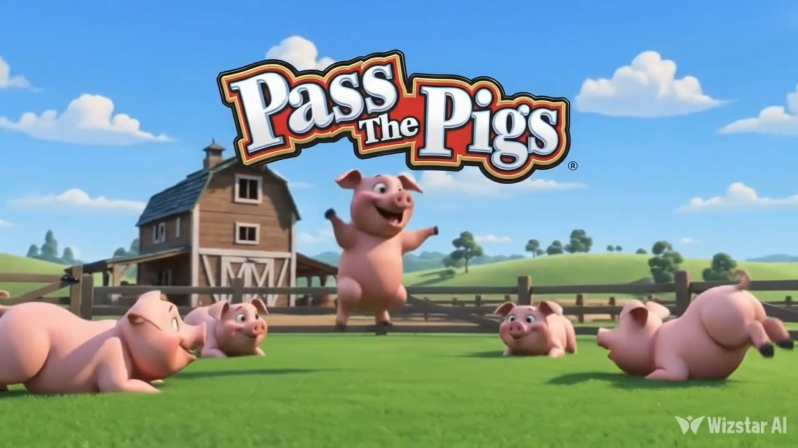
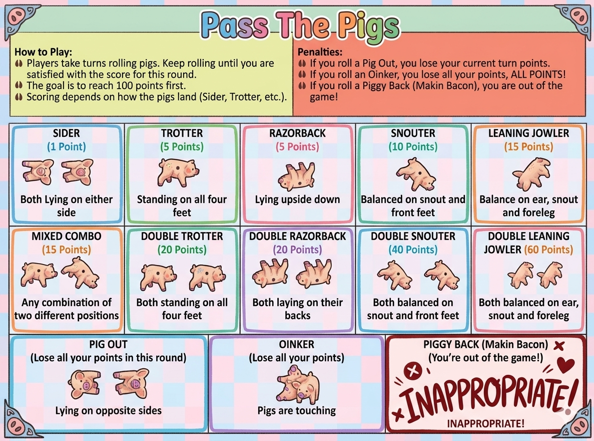

# Pass the Pigs – Score Keeper



A web app for keeping score in the dice game **Pass the Pigs**. Add your players, click the position each pig lands in, and the app tracks turn scores, running totals, penalties, and who has won the most games in your group — with a hoedown soundtrack.

Runs in any browser, works on phones, and needs no install or account.

If you don't don't have your pigs yet, go to the Pass The Pigs game store to grab a pair of pigs and start the fun!
Winning Moves game store: https://www.amazon.com/stores/WinningMovesGamesUSA/page/D0F4496D-27E1-4C32-9659-1020D7AE6FDD?lp_asin=B00005JG3Y

**Pass the Pigs scoring app here:** https://jd-nelson1444.github.io/passthepigs/

---

## How to use it

### Set up your group

The first time you open the app it asks whether you're starting a **new group** or **joining an existing one**.

- **New group** – pick a name (like "Smith Family" or "Cabin 3"). You'll get a 4‑digit code. Save it: if you want to use the same group name again, with the same players, you'll need both the group name and the code.
- **Join existing group** – enter the group's name and 4‑digit code.

Your device remembers the group, so you won't be asked again. **Show Code** in the header displays the code any time; **Switch Group** lets you move to a different one.

### Play a game

1. **Add players** (up to 10). Each player gets their own walk-up song that plays when it's their turn.
2. Click **My Turn** on the current player's card to open their scoring popup.
3. Roll the pigs and click the position they landed in. Points add to the turn score.
4. Click **End Turn** to bank the turn score and pass to the next player — or keep rolling and risk it.
5. First to **100 points** wins.

**Undo** reverses the last Click in the current turn. **View All Scores** shows everyone's running total. **Previous Winners** shows the all‑time win count for everyone in your group, including anyone at the table who hasn't won yet.

### Scoring



| Position | Points |
|---|---|
| Sider | 1 |
| Trotter | 5 |
| Razorback | 5 |
| Snouter | 10 |
| Leaning Jowler | 15 |
| Mixed Combo | 15 |
| Double Trotter | 20 |
| Double Razorback | 20 |
| Double Snouter | 40 |
| Double Leaning Jowler | 60 |

**Penalties** — each of these penalties ends your turn immediately:

| Roll | Effect |
|---|---|
| **Pig Out** (pigs on opposite sides) | Lose this turn's points |
| **Oinker** (pigs touching) | Lose *all* your points — back to 0 |
| **Piggy Back** (one pig on top of the other) | Out of the game |

Oinker and Piggy Back ask you to confirm before they take effect, since they can't be undone. The **Help** button shows a picture guide to the pig positions and scores for each.

### Playing with more than one device

It's designed for **one person keeping score** and the group of people playing are in the same physical room. It is possible to play remotely, so anyone who has joined the group sees the same players and scores, and updates appear on every device within a second or two. If two people click at the same time, the last click wins.

---

## How it's built

Plain HTML, CSS, and JavaScript — no framework, no build step. Game data is stored in [Firebase Firestore](https://firebase.google.com/docs/firestore), one document per group.

```
index.html        Page structure and popups
script.js         All game logic, Firestore sync, and sounds
style.css         Styling, including the phone layout
firestore.rules   Firestore security rules (a copy of what's deployed)
Audio/            Sound effects and music, one folder per event
Images/           Scoring guide shown by the Help button, and the README snapshot
Video/            Header video
```

### Run it locally

Any static file server works. With Python installed:

```bash
python -m http.server 8765
```

Then open http://localhost:8765. The app talks to the live Firestore project, so you'll need an internet connection.

### Hosting your own copy

If you fork this to run your own instance:

1. Create a Firebase project and enable Firestore.
2. Replace the `firebaseConfig` block at the top of `script.js` with your project's web config. (The API key there is not a secret — Firebase web keys identify the project; access is controlled entirely by the security rules.)
3. Publish the contents of `firestore.rules` in the Firebase console under **Firestore Database → Rules**. These rules let anyone read or update a group whose full ID they know, block listing groups, validate the shape of every write, and forbid deletes.
4. Host the files anywhere static — GitHub Pages works well.

---

## Credits

- Sound effects and music from [Pixabay](https://pixabay.com/), used under the [Pixabay Content License](https://pixabay.com/service/license-summary/).
- Header video created with Wizstar AI.

**Pass the Pigs** is a trademark of its respective owner. This is an unofficial, fan‑made score keeper and is not affiliated with or endorsed by the game's publisher.

## License

The code in this repository is released under the MIT License — see [LICENSE](LICENSE).

The audio, image, and video files are **not** covered by that license. They remain under the terms of their original sources noted above.
